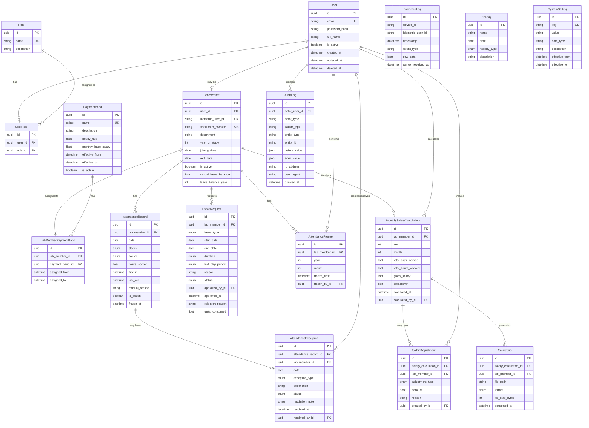

# Attend Ease - Entity Relationship Diagram

## ER Diagram (Mermaid)



## Critical Relationships Explained

### 1. User → Lab Member (0..1)
- A User may or may not be a Lab Member
- All Lab Members must have a User account
- Admins are Users but not Lab Members

### 2. Lab Member → Biometric Logs (via biometric_user_id)
- No direct FK relationship (biometric logs are raw, unmapped initially)
- Mapping happens via `biometric_user_id` field
- Allows for delayed/manual mapping of biometric identifiers

### 3. Attendance Record ← Biometric Logs (implicit)
- Attendance is DERIVED from biometric logs
- No direct FK to preserve biometric log immutability
- Derivation engine queries biometric logs by date range

### 4. Attendance Record ↔ Leave Request (override)
- Approved leave OVERRIDES biometric-derived attendance
- Source changes to LEAVE_OVERRIDE
- Original biometric data remains untouched

### 5. Attendance Record ↔ Attendance Exception (1:1)
- If attendance derivation fails, exception is created
- Blocks freeze until resolved
- Resolution updates attendance record with MANUAL source

### 6. Attendance Freeze → Salary Calculation (enables)
- Freeze creates immutability boundary
- Salary calculation requires freeze to exist
- Both are immutable after creation

### 7. Audit Log → All Entities (tracks)
- No FK constraints (to prevent cascade issues)
- Stores entity_type and entity_id as strings
- Supports historical queries even if entity is deleted

## Data Flow Diagram

```
┌─────────────────┐
│ Biometric Device│
└────────┬────────┘
         │
         ▼
┌─────────────────────┐
│ BiometricLog (raw)  │ ◄─── APPEND-ONLY, NEVER UPDATED
└────────┬────────────┘
         │
         │ [Derivation Engine runs daily]
         │
         ▼
┌─────────────────────────────┐
│ AttendanceRecord (derived)  │
│ source: BIOMETRIC           │
│ status: FULL_DAY / HALF_DAY │
│         LOP / PENDING_EXC   │
└────────┬────────────────────┘
         │
         ├──────► [Exception detected?] ──► AttendanceException (PENDING)
         │                                          │
         │                                          │ [Admin resolves]
         │                                          │
         │        ◄─────────────────────────────────┘
         │        AttendanceRecord updated
         │        source: MANUAL, manual_reason required
         │
         ├──────► [Leave approved?] ──────────────► LeaveRequest (APPROVED)
         │                                                 │
         │        ◄────────────────────────────────────────┘
         │        AttendanceRecord updated
         │        source: LEAVE_OVERRIDE
         │        status: CASUAL_LEAVE_FULL/HALF
         │
         ▼
    [End of month]
         │
         ▼
┌─────────────────────┐
│ Freeze Check        │ ◄─── Blocks if any PENDING_EXCEPTION exists
└────────┬────────────┘
         │
         │ [All exceptions resolved]
         │
         ▼
┌─────────────────────┐
│ AttendanceFreeze    │ ◄─── IMMUTABLE, one per member per month
└────────┬────────────┘
         │
         │ [Freeze exists]
         │
         ▼
┌──────────────────────────────┐
│ MonthlySalaryCalculation     │ ◄─── DERIVED, IMMUTABLE
│ - Reads frozen attendance    │
│ - Applies payment band       │
│ - Stores breakdown (JSONB)   │
└────────┬─────────────────────┘
         │
         ├──────► SalaryAdjustment (optional, audited)
         │
         ▼
┌─────────────────────┐
│ SalarySlip          │ ◄─── Generated (PDF/XLSX/CSV)
│ (PDF/XLSX/CSV)      │
└─────────────────────┘
         │
         ▼
    [Lab member downloads]
```

## Append-Only Tables (CRITICAL)

These tables MUST NEVER be updated or deleted:
1. `BiometricLog` - Raw device data
2. `AuditLog` - Audit trail
3. `AttendanceFreeze` - Freeze boundary (after creation)
4. `MonthlySalaryCalculation` - Calculated salary (after creation)
5. `SalarySlip` - Generated slips

## Immutability Enforcement

### Database Level
- Use CHECK constraints for status transitions
- Use triggers to prevent updates on frozen attendance
- Use row-level security (RLS) if needed

### Application Level
- DAO layer prevents update/delete on append-only tables
- Service layer enforces freeze checks before mutations
- Transaction boundaries ensure atomicity

## Indexing Strategy

### High-Volume Tables
- `biometric_logs`: 300+ members × 4 scans/day × 365 days = ~438K records/year
  - Index: (biometric_user_id, timestamp)
  - Index: (server_received_at)

- `attendance_records`: 300+ members × 365 days = ~109K records/year
  - Index: (lab_member_id, date) [UNIQUE]
  - Index: (is_frozen, date)

- `audit_logs`: High volume, time-series queries
  - Index: (created_at DESC)
  - Index: (entity_type, entity_id)
  - Index: (actor_user_id, created_at)

### Performance Considerations
- Partition `biometric_logs` by month/year (future optimization)
- Partition `audit_logs` by month (for compliance retention)
- Archive old salary slips to cold storage after 3+ years
